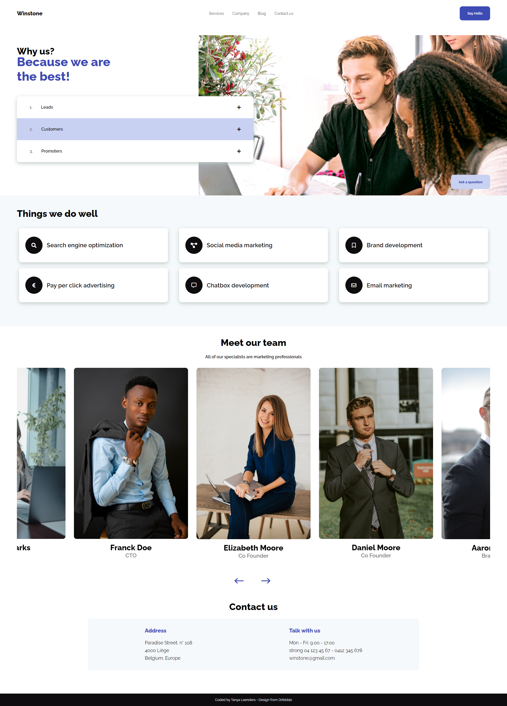

# Marketing-Agency-Design

I wanted a quick challenge, so I looked up for designs on Dribbble and I found this design. Added a contact section and a footer. When the responsive was less showed on the design, I imagined my own.  
It was the first time I used the Slick carousel library, I really wanted to try it and dive a bit into their documentation.

## Project presentation:
Solo project.
My goal was to reproduce and improve a [design](https://dribbble.com/shots/15433764-Winstone-Responsive-design-for-the-marketing-agency) that I found and loved on Dribbble.

### When
Duration: one day, July 2021.

## Screenshots

## Technologies
- HTML
- SCSS
- JS
- Slick carousel Library
- FontAwesome for the icons
- Pexels for the pictures
